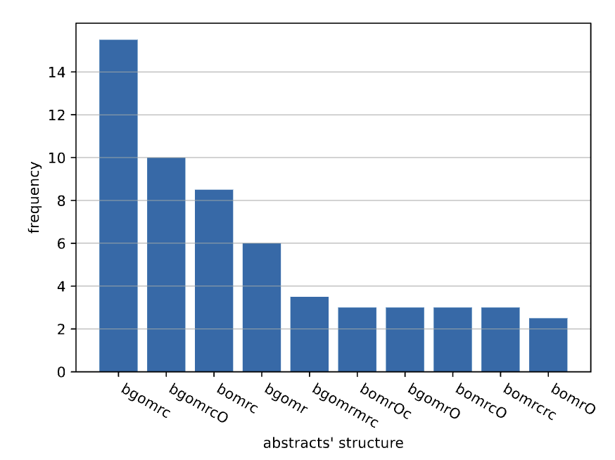
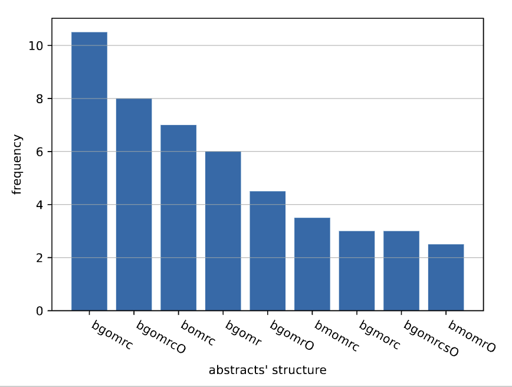
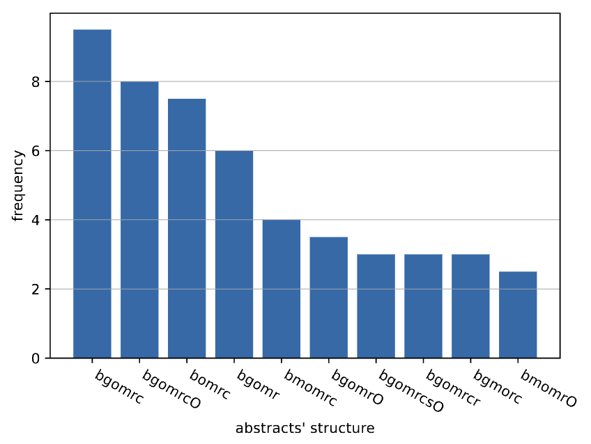

This document summarizes a number of quality issues regarding the data processing and analysis.
They were discovered while attempting to replace the hard-coded values in the `.tex` file with inline-expressions
(Knitr's `\Sexpr{}`), which required identifying the relevant parts in the Python datasets.

# Load Data and Run Python Statistics

```{r}
## This is R
library(reticulate)
# Use R's reticulate to load Python modules (import qabs.dataframes as dataframes)
py$dataframes <- import_from_path("qabs.dataframes", path = ".")
```

```{python}
## This is Python
import pandas as pd

# Load data
datafile = "../results/abstracts-results.tsv"
raw = pd.read_csv(datafile, sep='\t')

# Perform the statistics
datasets = dataframes.create_all_datasets(raw)
dataframes.create_all_subsets(datasets)
```

```{r, message=FALSE}
## This is R
library(dplyr)
library(tidyr)

# Make Python variables available to R, so they can be used in the following document
for (var in names(py)) {
  assign(var, py[[var]], envir = .GlobalEnv)
}

raw <- raw |> as_tibble()
```

## Simple Statistics and A Glimpse into the Structure
```{r}
(n_abstracts_raw <- n_distinct(raw$citekey))
(n_abstracts_py  <- n_distinct(datasets$by_abstract$`_citekey`))
```

```{r}
raw |> head(1) |> t()
datasets$by_abstract_coding |> head(1) |> t()
datasets$by_abstract |> head(1) |> t()
```

# Issues that cause wrong numbers

## Problem: Unclear calculation of `ignorediffs` (RESOLVED)

There was some issue with the calculation of the `ignorediffs` column.

**Example:** `AtaMasHem22` has 2 sentences which Lutz annotated with `-ignorediff`.
In the Python dataset, however, the numbers 4 (for Lutz) and 2 (for Lloyd) showed up.

However, this issues appears to be resolved as of now:

```{r}
# The raw data (codings)
raw |> filter(citekey == "AtaMasHem22") |>
    filter("ignorediff" %in% code, .by = sidx) |>
    select(citekey, coder, codername, sidx, words, code) |>
    arrange(codername, sidx)
# Individual abstract-level codings
datasets$by_abstract_coding |>
    filter(`_citekey` == 'AtaMasHem22') |>
    select(`_citekey`, `_coder`, codername, ignorediffs)
# Abstract-level aggregation
datasets$by_abstract |>
    filter(`_citekey` == 'AtaMasHem22') |>
    select(`_citekey`, ignorediffs)
```

The numbers are summed up correctly and the aggregated count is also correct.


## Problem: Different Word Counts (RESOLVED)
Several abstracts used to differ in their word count.

This appears to be no longer an issue, as the biggest difference are due to rounding errors
(one coder give 2 codes, the other 3 -> sentence length is divided by 2 and by 3, rounded to one decimal place -> sums are 0.1 off).

```{r}
assert_coder_sameness <- function(field) {
    with_diff <- datasets$by_abstract_coding |>
        filter(min({{field}}) != max({{field}}), .by = `_citekey`) |>
        select(`_citekey`, `_coder`, {{field}})
    if (nrow(with_diff) == 0) return ("No differences")
    with_diff |>
        pivot_wider(id_cols = `_citekey`, names_from = `_coder`, values_from = {{field}}) |>
        mutate(diff = abs(A - B)) |>
        arrange(desc(diff))
}

assert_coder_sameness(words)
```

Let's check all the other fields that should not be different between coders A and B:

```{r}
assert_coder_sameness(venue)
assert_coder_sameness(volume)
assert_coder_sameness(sentences)
assert_coder_sameness(chars)
assert_coder_sameness(syllables)
assert_coder_sameness(avg_wordlength)
```

Note: `fkscore` should also be same -- see next problem.


## Problem: Different `fkscore`s (RESOLVED)

A few abstracts had different `fkscore`s in the past,
but now any difference is small and probably due to rounding errors:

```{r}
assert_coder_sameness(fkscore)
```


## Problem: Calculation of `fkscore` ignores multi-codings (RESOLVED)

Abstract-level `fkscore` used to be calculated by taking the mean of sentences' `fkscore`,
which was off for double (or triple) coded sentences.
This is no longer an issue, since the calculation is now done for the whole abstract.


## Problem: Improper Calculation of Fresch-Kincaid (RESOLVED)

Abstract-level `fkscore` used to be calculated by taking the mean of sentences' `fkscore`.
This is no longer an issue, since the calculation is now done for the whole abstract.

To illustrate the issue nevertheless, consider the first four sentences of `CheHuWei22`:

```
Source code summarization is a crucial yet far from settled task for describing structured code
snippets in natural language.
High-quality code summaries could effectively facilitate program comprehension
and software maintenance.
A good code summary is supposed to have the following characteristics:
complete
information, correct meaning, and consistent description.
```

Calculating the FRES for each sentence individually (setting _total sentences := 1_) and calculating the average gives:


```{r}
example <- raw |> filter(citekey == "CheHuWei22", coder == "A", sidx >= 2, sidx <= 5) |>
    select(words, syllables, fkscore) |> # Note: requires "syllables" column in raw data!
    mutate(words = words + 1) |> # Fixing the word count -- see next problem!
    mutate(fres = 206.835 - 1.015 * words / 1 - 84.6 * (syllables / words))
example
mean(example$fres)
```

But using the formula properly and taking all sentences into account,
the overall score is:

```{r}
example |>
    summarize(fres = 206.835 - 1.015 * (sum(words) / n()) - 84.6 * (sum(syllables) / sum(words)))
```


## Problem: Improper Word Count (RESOLVED)

Word counts where off in the past:
Consider a sentence with 31 words with 1, 2, or 3 codes.

| Codings | Correct Word Count | Old Word Count |
|---------|--------------------|----------------|
| 1       | 1 x 31             | 1 x 30         |
| 2       | 2 x 15.5           | 2 x 30         |
| 3       | 3 x 10.3           | 3 x 15         |


This appears to be no issue anymore.
As an example, consider sentence ID 8 from `LiuLiFu22` (including its three codes) looks like this:

```
Experimen-
tal results on java methods show that our model can outperform
the state-of-the-art results by a large margin on method name sug-
gestion, demonstrating the effectiveness of our proposed model.
{{a-method,result:i1,conclusion}}
```

The logic in `qscript/annotations.py` calculates the following values:

- words: 31
- syllables: 58
- chars: 204

The export logic in `qabs/export.py` however, creates the following three entries:

```{r}
raw |> filter(citekey == "LiuLiFu22", coder == "B", sidx == 8) |>
    select(citekey, sidx, words, chars, syllables, code, suffixes, topic)
```

Which is correct.


## Erratic Abstract Structures

Without changing the data or the scripts, running `make export` and `make plotall` gives different plots
for the abstract structures.

Here are three examples:

| 1. | 2. | 3. |
|----|----|----|
|  |  |  |


# Issues related to Double Coding of Abstracts
The following issues do not lead to _wrong_ number per se, but to questionable ones.

## I-Gaps and U-Gaps
Each abstract has two `icount` and `ucount` values, which are often not the same:

```{r}
datasets$by_abstract_coding |>
    filter(min(icount) != max(icount) | min(ucount) != max(ucount), .by = `_citekey`) |>
    select(`_citekey`, `_coder`, icount, ucount) |>
    pivot_wider(id_cols = `_citekey`, names_from = `_coder`, values_from = c(icount, ucount))
```

When aggregating from individual codings to a single value for each abstract,
we need to make a decision on how to count gaps:
Do we require that both coders saw an i-gap (`i_min`), at least one saw an i-gap (`i_max`),
or they saw at least one i-gap on average (`i_mean`, e.g., 0 and 2+ gaps, respectively).
Each leads to quite different percentages of abstracts with one or more i-gaps:

```{r}
datasets$by_abstract_coding |>
    group_by(`_citekey`) |>
    summarize(i_min = min(icount), i_mean = mean(icount), i_max = max(icount)) |>
    summarize(across(c(i_min, i_mean, i_max), ~sum(. >= 1) / n() * 100)) |>
    t()
```

The same question arises for u-gaps as well (again, percentages of abstracts with one or more such gaps):

```{r}
datasets$by_abstract_coding |>
    group_by(`_citekey`) |>
    summarize(u_min = min(ucount), u_mean = mean(ucount), u_max = max(ucount)) |>
    summarize(across(c(u_min, u_mean, u_max), ~sum(. >= 1) / n() * 100)) |>
    t()
```

## Completeness and Properness

Whether or not an abstract is _complete_ can be judged differently between the two coders
(if they don't agree on critical elements):

```{r}
datasets$by_abstract_coding |>
    filter(sum(is_complete) == 1, .by = `_citekey`) |>
    select(`_citekey`, `_coder`, is_complete) |>
    pivot_wider(id_cols = `_citekey`, names_from = `_coder`, values_from = is_complete, names_prefix = "is_complete_")
```

There are two alternatives for how to combine the individual _completeness_ values: `AND` and `OR`.
The percentage of _complete_ abstracts varies slightly:

```{r}
datasets$by_abstract_coding |>
    group_by(`_citekey`) |>
    summarize(c_and = all(is_complete), c_or = any(is_complete)) |>
    summarize(across(c(c_and, c_or), ~sum(.) / n() * 100)) |>
    t()
```

The number of _proper_ abstracts is more difficult to conceptualize.

Example: Consider an abstract where coder A saw one i-gap (`icount=1`) and coder B saw one u-gap (`ucount=1`).
Such an abstract would not be _proper_ for either of them.
No matter how we combine their _properness_ values (`AND` or `OR`), the abstract will not be counted as _proper_.
If, however, we decide to take the `min` or `mean` approach for combining A's and B's `icount` and `ucount` values,
the abstract will have less than 1 `icount` and less than 1 `ucount` -- and thus qualify for being _proper_.
_Whoops!_

Luckily, this appears to be a theoretical issue.
We cannot frankenstein a _proper_ abstract of any two non-proper A and B codings:
```{r}
datasets$by_abstract_coding |>
    group_by(`_citekey`) |>
    summarize( # combine A and B in best possible way
        is_complete = any(is_complete),
        fkscore = max(fkscore),
        icount = min(icount),
        announcecount = min(announcecount),
        ucount = min(ucount),
        ignorediffs = min(ignorediffs),
        is_proper_none = !any(is_proper),
        is_proper_hypo = is_complete & fkscore >= 20 & announcecount == 0 & icount == 0 & ucount == 0 & ignorediffs == 0
    ) |>
    filter(is_proper_none & is_proper_hypo)    
```

We can therefore disregard this issue and just focus on combining the two `is_proper` values with either `AND` or `OR`.
We get the following percentages for _proper_ abstracts, depending on how we combine A and B codings:

```{r}
datasets$by_abstract_coding |>
    group_by(`_citekey`) |>
    summarize(p_and = all(is_proper), p_or = any(is_proper)) |>
    summarize(across(c(p_and, p_or), ~sum(.) / n() * 100)) |>
    t()
```

These are abstracts for which A's and B's coding do not lead to the same `is_proper` values:
```{r}
datasets$by_abstract_coding |>
    filter(sum(is_proper) == 1, .by = `_citekey`) |>
    select(`_citekey`, `_coder`, is_proper) |>
    pivot_wider(id_cols = `_citekey`, names_from = `_coder`, values_from = is_proper, names_prefix = "is_proper_")
```

## `ignorediff` is not always a problem

Consider this case:

```{r}
raw |>
    filter(citekey == 'GonRajHas22', sidx == 5) |>
    select(citekey, coder, codername, sidx, words, chars, syllables, fkscore, code, topic)
```

This sentence is coded differently `method` vs. `objective`/`method`:

> Therefore, through a case study of 9 open source software projects across
> 30 versions, we study the relative effectiveness of SNA metrics when compared to
> code metrics across 3 commonly used SDP contexts (Within-project, Cross-version
> and Cross-project) and scenarios (Defect-count, Defect-classification (classifying
> if a module is defective) and Effort-aware (ranking the defective modules w.r.t to the involved effort)).

So, does this formulation from the article really capture the "issue"?:

> The respective sentence (or sentence part) is so highly ambiguous that
> more than one role for it is similarly likely.
> Obviously, such ambiguous formulations do not represent good abstract
> writing and we consider such abstracts to be _improper_.

(Note: Without the double-coding, the abstract would not have any `objective` statement and thus be _incomplete_
-- but not because of "highly ambiguous" sentences.)
