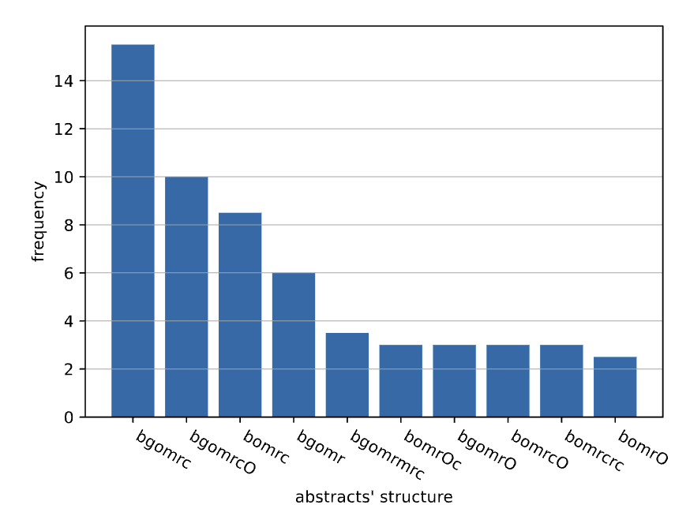
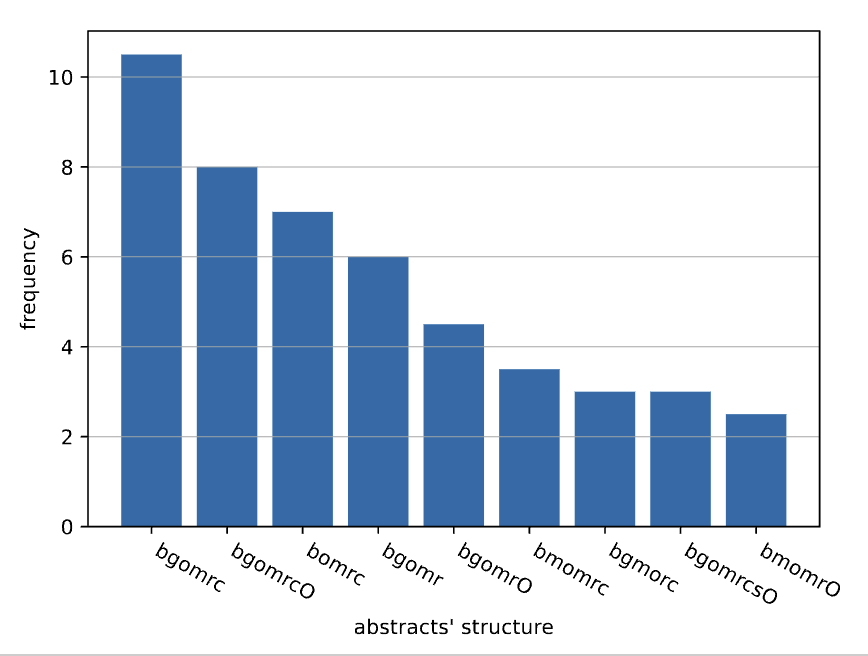
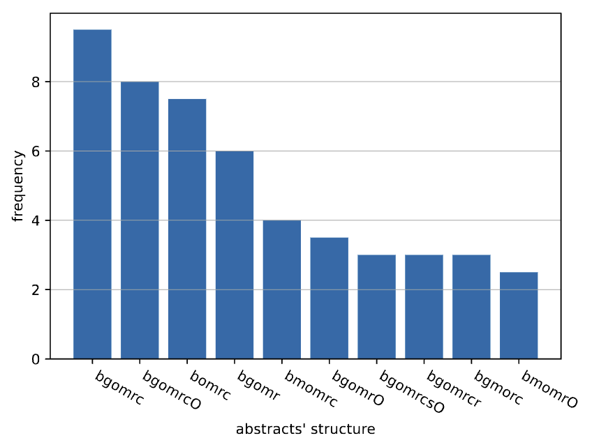

This document summarizes a number of quality issues regarding the data
processing and analysis. They were discovered while attempting to
replace the hard-coded values in the `.tex` file with inline-expressions
(Knitr’s `\Sexpr{}`), which required identifying the relevant parts in
the Python datasets.

# 1 Load Data and Run Python Statistics

``` r
## This is R
library(reticulate)
# Use R's reticulate to load Python modules (import qabs.dataframes as dataframes)
py$dataframes <- import_from_path("qabs.dataframes", path = ".")
```

``` python
## This is Python
import pandas as pd

# Load data
datafile = "../results/abstracts-results.tsv"
raw = pd.read_csv(datafile, sep='\t')

# Perform the statistics
datasets = dataframes.create_all_datasets(raw)
dataframes.create_all_subsets(datasets)
```

``` r
## This is R
library(dplyr)
library(tidyr)

# Make Python variables available to R, so they can be used in the following document
for (var in names(py)) {
  assign(var, py[[var]], envir = .GlobalEnv)
}

raw <- raw |> as_tibble()
```

## 1.1 Simple Statistics and A Glimpse into the Structure

``` r
(n_abstracts_raw <- n_distinct(raw$citekey))
```

    ## [1] 362

``` r
(n_abstracts_py  <- n_distinct(datasets$by_abstract$`_citekey`))
```

    ## [1] 362

``` r
raw |> head(1) |> t()
```

    ##           [,1]         
    ## citekey   "PanLinZam22"
    ## venue     "TOSEM"      
    ## volume    "TOSEM22"    
    ## coder     "B"          
    ## codername "Franz"      
    ## sidx      "2"          
    ## words     "11"         
    ## chars     "94"         
    ## syllables "28"         
    ## fkscore   "-19.7"      
    ## code      "background" 
    ## suffixes  NA           
    ## topic     "background" 
    ## icount    "0"          
    ## ucount    "0"

``` r
datasets$by_abstract_coding |> head(1) |> t()
```

    ##                             1            
    ## _citekey                    "AbdBadCos22"
    ## _coder                      "A"          
    ## venue                       "TSE"        
    ## volume                      "TSE22"      
    ## codername                   "Lutz"       
    ## sentences                   "11"         
    ## words                       "284"        
    ## chars                       "1901"       
    ## syllables                   "520"        
    ## ignorediffs                 "0"          
    ## codes                       "12"         
    ## utopics                     "6"          
    ## icount                      "1"          
    ## ucount                      "2"          
    ## announcecount               "0"          
    ## is_struc                    "FALSE"      
    ## is_design                   "FALSE"      
    ## fkscore                     "27.91192"   
    ## words_background            "65"         
    ## fraction_background         "22.88732"   
    ## words_gap                   "14"         
    ## fraction_gap                "4.929577"   
    ## words_objective             "51"         
    ## fraction_objective          "17.95775"   
    ## words_design                NA           
    ## fraction_design             "0"          
    ## words_method                "45"         
    ## fraction_method             "15.84507"   
    ## words_result                "92"         
    ## fraction_result             "32.39437"   
    ## words_summary               NA           
    ## fraction_summary            "0"          
    ## words_conclusion            "17"         
    ## fraction_conclusion         "5.985915"   
    ## words_Outlook               NA           
    ## fraction_Outlook            "0"          
    ## words_other                 NA           
    ## fraction_other              "0"          
    ## words_backgroundcode        "65"         
    ## fraction_code_background    "22.88732"   
    ## words_gapcode               "14"         
    ## fraction_code_gap           "4.929577"   
    ## words_objectivecode         "51"         
    ## fraction_code_objective     "17.95775"   
    ## words_methodcode            "45"         
    ## fraction_code_method        "15.84507"   
    ## words_resultcode            "92"         
    ## fraction_code_result        "32.39437"   
    ## words_conclusioncode        "17"         
    ## fraction_code_conclusion    "5.985915"   
    ## words_a_methodcode          NA           
    ## fraction_code_a_method      "0"          
    ## words_a_resultcode          NA           
    ## fraction_code_a_result      "0"          
    ## words_a_conclusioncode      NA           
    ## fraction_code_a_conclusion  "0"          
    ## words_a_fposscode           NA           
    ## fraction_code_a_fposs       "0"          
    ## fraction_introduction       "27.8169"    
    ## fraction_conclusion_longbg  NA           
    ## fraction_conclusion_shortbg NA           
    ## avg_wordlength              "5.493662"   
    ## total_gaps                  "3"          
    ## is_complete                 "TRUE"       
    ## is_proper                   "FALSE"

``` r
datasets$by_abstract |> head(1) |> t()
```

    ##                             AbdBadCos22  
    ## _citekey                    "AbdBadCos22"
    ## venue                       "TSE"        
    ## volume                      "TSE22"      
    ## sentences                   "11"         
    ## words                       "284"        
    ## chars                       "1901"       
    ## syllables                   "520"        
    ## fkscore                     "27.91192"   
    ## avg_wordlength              "5.493662"   
    ## ignorediffs                 "0"          
    ## codes                       "12"         
    ## utopics                     "6"          
    ## icount                      "0"          
    ## ucount                      "0"          
    ## total_gaps                  "3"          
    ## announcecount               "0"          
    ## fraction_introduction       "27.8169"    
    ## fraction_background         "22.88732"   
    ## fraction_gap                "4.929577"   
    ## fraction_objective          "17.95775"   
    ## fraction_design             "0"          
    ## fraction_method             "15.84507"   
    ## fraction_result             "32.39437"   
    ## fraction_Outlook            "0"          
    ## fraction_conclusion         "5.985915"   
    ## fraction_other              "0"          
    ## fraction_code_a_method      "0"          
    ## fraction_code_a_result      "0"          
    ## fraction_code_a_conclusion  "0"          
    ## fraction_code_a_fposs       "0"          
    ## fraction_conclusion_shortbg NA           
    ## fraction_conclusion_longbg  NA           
    ## is_struc                    "FALSE"      
    ## is_design                   "FALSE"      
    ## is_complete                 "TRUE"       
    ## is_proper                   "TRUE"

# 2 Issues that cause wrong numbers

## 2.1 Problem: Unclear calculation of `ignorediffs` (RESOLVED)

There was some issue with the calculation of the `ignorediffs` column.

**Example:** `AtaMasHem22` has 2 sentences which Lutz annotated with
`-ignorediff`. In the Python dataset, however, the numbers 4 (for Lutz)
and 2 (for Lloyd) showed up.

However, this issues appears to be resolved as of now:

``` r
# The raw data (codings)
raw |> filter(citekey == "AtaMasHem22") |>
    filter("ignorediff" %in% code, .by = sidx) |>
    select(citekey, coder, codername, sidx, words, code) |>
    arrange(codername, sidx)
```

    ## # A tibble: 6 × 6
    ##   citekey     coder codername  sidx words code      
    ##   <chr>       <chr> <chr>     <dbl> <dbl> <chr>     
    ## 1 AtaMasHem22 B     Lloyd         5    29 background
    ## 2 AtaMasHem22 B     Lloyd         6    15 background
    ## 3 AtaMasHem22 A     Lutz          5   NaN ignorediff
    ## 4 AtaMasHem22 A     Lutz          5    29 design    
    ## 5 AtaMasHem22 A     Lutz          6   NaN ignorediff
    ## 6 AtaMasHem22 A     Lutz          6    15 design

``` r
# Individual abstract-level codings
datasets$by_abstract_coding |>
    filter(`_citekey` == 'AtaMasHem22') |>
    select(`_citekey`, `_coder`, codername, ignorediffs)
```

    ##      _citekey _coder codername ignorediffs
    ## 1 AtaMasHem22      A      Lutz           2
    ## 2 AtaMasHem22      B     Lloyd           2

``` r
# Abstract-level aggregation
datasets$by_abstract |>
    filter(`_citekey` == 'AtaMasHem22') |>
    select(`_citekey`, ignorediffs)
```

    ##                _citekey ignorediffs
    ## AtaMasHem22 AtaMasHem22           2

The numbers are summed up correctly and the aggregated count is also
correct.

## 2.2 Problem: Different Word Counts (RESOLVED)

Several abstracts used to differ in their word count.

This appears to be no longer an issue, as the biggest difference are due
to rounding errors (one coder give 2 codes, the other 3 -\> sentence
length is divided by 2 and by 3, rounded to one decimal place -\> sums
are 0.1 off).

``` r
assert_coder_sameness <- function(field) {
    with_diff <- datasets$by_abstract_coding |>
        filter(min({{field}}) != max({{field}}), .by = `_citekey`) |>
        select(`_citekey`, `_coder`, {{field}})
    if (nrow(with_diff) == 0) return ("No differences")
    with_diff |>
        pivot_wider(id_cols = `_citekey`, names_from = `_coder`, values_from = {{field}}) |>
        mutate(diff = abs(A - B)) |>
        arrange(desc(diff))
}

assert_coder_sameness(words)
```

    ## # A tibble: 1 × 4
    ##   `_citekey`     A     B  diff
    ##   <chr>      <dbl> <dbl> <dbl>
    ## 1 YanXiaLo22  137.   137 0.100

Let’s check all the other fields that should not be different between
coders A and B:

``` r
assert_coder_sameness(venue)
```

    ## [1] "No differences"

``` r
assert_coder_sameness(volume)
```

    ## [1] "No differences"

``` r
assert_coder_sameness(sentences)
```

    ## [1] "No differences"

``` r
assert_coder_sameness(chars)
```

    ## # A tibble: 1 × 4
    ##   `_citekey`     A     B  diff
    ##   <chr>      <dbl> <dbl> <dbl>
    ## 1 YanXiaLo22  886.   886 0.100

``` r
assert_coder_sameness(syllables)
```

    ## # A tibble: 1 × 4
    ##   `_citekey`     A     B  diff
    ##   <chr>      <dbl> <dbl> <dbl>
    ## 1 YanXiaLo22  244.   244 0.100

``` r
assert_coder_sameness(avg_wordlength)
```

    ## # A tibble: 1 × 4
    ##   `_citekey`     A     B    diff
    ##   <chr>      <dbl> <dbl>   <dbl>
    ## 1 YanXiaLo22  5.27  5.27 0.00545

Note: `fkscore` should also be same – see next problem.

## 2.3 Problem: Different `fkscore`s (RESOLVED)

A few abstracts had different `fkscore`s in the past, but now any
difference is small and probably due to rounding errors:

``` r
assert_coder_sameness(fkscore)
```

    ## # A tibble: 5 × 4
    ##   `_citekey`      A     B  diff
    ##   <chr>       <dbl> <dbl> <dbl>
    ## 1 GonRajHas22 21.3  24.6   3.30
    ## 2 YanXiaLo22  38.7  36.3   2.45
    ## 3 CasZamNov22 24.6  26.9   2.26
    ## 4 WalGhaAla22 17.3  18.7   1.41
    ## 5 Liu22       -3.57 -2.36  1.21

## 2.4 Problem: Calculation of `fkscore` ignores multi-codings (RESOLVED)

Abstract-level `fkscore` used to be calculated by taking the mean of
sentences’ `fkscore`, which was off for double (or triple) coded
sentences. This is no longer an issue, since the calculation is now done
for the whole abstract.

## 2.5 Problem: Improper Calculation of Fresch-Kincaid (RESOLVED)

Abstract-level `fkscore` used to be calculated by taking the mean of
sentences’ `fkscore`. This is no longer an issue, since the calculation
is now done for the whole abstract.

To illustrate the issue nevertheless, consider the first four sentences
of `CheHuWei22`:

    Source code summarization is a crucial yet far from settled task for describing structured code
    snippets in natural language.
    High-quality code summaries could effectively facilitate program comprehension
    and software maintenance.
    A good code summary is supposed to have the following characteristics:
    complete
    information, correct meaning, and consistent description.

Calculating the FRES for each sentence individually (setting *total
sentences := 1*) and calculating the average gives:


``` r
example <- raw |> filter(citekey == "CheHuWei22", coder == "A", sidx >= 2, sidx <= 5) |>
    select(words, syllables, fkscore) |> # Note: requires "syllables" column in raw data!
    mutate(words = words + 1) |> # Fixing the word count -- see next problem!
    mutate(fres = 206.835 - 1.015 * words / 1 - 84.6 * (syllables / words))
example
```

    ## # A tibble: 4 × 4
    ##   words syllables fkscore  fres
    ##   <dbl>     <dbl>   <dbl> <dbl>
    ## 1    20        34    36.2  42.7
    ## 2    12        31   -42.7 -23.9
    ## 3    12        21    34.2  46.6
    ## 4     8        17    -5.7  18.9

``` r
mean(example$fres)
```

    ## [1] 21.09125

But using the formula properly and taking all sentences into account,
the overall score is:

``` r
example |>
    summarize(fres = 206.835 - 1.015 * (sum(words) / n()) - 84.6 * (sum(syllables) / sum(words)))
```

    ## # A tibble: 1 × 1
    ##    fres
    ##   <dbl>
    ## 1  26.1

## 2.6 Problem: Improper Word Count (RESOLVED)

Word counts where off in the past: Consider a sentence with 31 words
with 1, 2, or 3 codes.

| Codings | Correct Word Count | Old Word Count |
|---------|--------------------|----------------|
| 1       | 1 x 31             | 1 x 30         |
| 2       | 2 x 15.5           | 2 x 30         |
| 3       | 3 x 10.3           | 3 x 15         |

This appears to be no issue anymore. As an example, consider sentence ID
8 from `LiuLiFu22` (including its three codes) looks like this:

    Experimen-
    tal results on java methods show that our model can outperform
    the state-of-the-art results by a large margin on method name sug-
    gestion, demonstrating the effectiveness of our proposed model.
    {{a-method,result:i1,conclusion}}

The logic in `qscript/annotations.py` calculates the following values:

- words: 31
- syllables: 58
- chars: 204

The export logic in `qabs/export.py` however, creates the following
three entries:

``` r
raw |> filter(citekey == "LiuLiFu22", coder == "B", sidx == 8) |>
    select(citekey, sidx, words, chars, syllables, code, suffixes, topic)
```

    ## # A tibble: 3 × 8
    ##   citekey    sidx words chars syllables code       suffixes topic     
    ##   <chr>     <dbl> <dbl> <dbl>     <dbl> <chr>      <chr>    <chr>     
    ## 1 LiuLiFu22     8  10.3    68      19.3 result     :i1      result    
    ## 2 LiuLiFu22     8  10.3    68      19.3 a-method   <NA>     method    
    ## 3 LiuLiFu22     8  10.3    68      19.3 conclusion <NA>     conclusion

Which is correct.

## 2.7 Erratic Abstract Structures

Without changing the data or the scripts, running `make export` and
`make plotall` gives different plots for the abstract structures.

Here are three examples:

| 1\.           | 2\.           | 3\.           |
|---------------|---------------|---------------|
|  |  |  |

# 3 Issues related to Double Coding of Abstracts

The following issues do not lead to *wrong* number per se, but to
questionable ones.

## 3.1 I-Gaps and U-Gaps

Each abstract has two `icount` and `ucount` values, which are often not
the same:

``` r
datasets$by_abstract_coding |>
    filter(min(icount) != max(icount) | min(ucount) != max(ucount), .by = `_citekey`) |>
    select(`_citekey`, `_coder`, icount, ucount) |>
    pivot_wider(id_cols = `_citekey`, names_from = `_coder`, values_from = c(icount, ucount))
```

    ## # A tibble: 215 × 5
    ##    `_citekey`  icount_A icount_B ucount_A ucount_B
    ##    <chr>          <dbl>    <dbl>    <dbl>    <dbl>
    ##  1 AbdBadCos22        1        0        2        0
    ##  2 AbiRahOpe22        3        2        0        0
    ##  3 AhmAshAzg22        1        1        1        0
    ##  4 AhmFanYi22         4        2        0        1
    ##  5 AlDAhmMah22        1        3        0        0
    ##  6 AlkAlaKeb22        2        1        0        1
    ##  7 AlmGay22           4        7        0        0
    ##  8 AlmKorTah22        0        1        0        0
    ##  9 AmnPoe22           1        0        0        0
    ## 10 AndLimMar22        1        0        0        0
    ## # ℹ 205 more rows

When aggregating from individual codings to a single value for each
abstract, we need to make a decision on how to count gaps: Do we require
that both coders saw an i-gap (`i_min`), at least one saw an i-gap
(`i_max`), or they saw at least one i-gap on average (`i_mean`, e.g., 0
and 2+ gaps, respectively). Each leads to quite different percentages of
abstracts with one or more i-gaps:

``` r
datasets$by_abstract_coding |>
    group_by(`_citekey`) |>
    summarize(i_min = min(icount), i_mean = mean(icount), i_max = max(icount)) |>
    summarize(across(c(i_min, i_mean, i_max), ~sum(. >= 1) / n() * 100)) |>
    t()
```

    ##            [,1]
    ## i_min  43.92265
    ## i_mean 53.03867
    ## i_max  66.29834

The same question arises for u-gaps as well (again, percentages of
abstracts with one or more such gaps):

``` r
datasets$by_abstract_coding |>
    group_by(`_citekey`) |>
    summarize(u_min = min(ucount), u_mean = mean(ucount), u_max = max(ucount)) |>
    summarize(across(c(u_min, u_mean, u_max), ~sum(. >= 1) / n() * 100)) |>
    t()
```

    ##             [,1]
    ## u_min   5.248619
    ## u_mean 10.497238
    ## u_max  26.243094

## 3.2 Completeness and Properness

Whether or not an abstract is *complete* can be judged differently
between the two coders (if they don’t agree on critical elements):

``` r
datasets$by_abstract_coding |>
    filter(sum(is_complete) == 1, .by = `_citekey`) |>
    select(`_citekey`, `_coder`, is_complete) |>
    pivot_wider(id_cols = `_citekey`, names_from = `_coder`, values_from = is_complete, names_prefix = "is_complete_")
```

    ## # A tibble: 4 × 3
    ##   `_citekey`  is_complete_A is_complete_B
    ##   <chr>       <lgl>         <lgl>        
    ## 1 FahGruBey22 FALSE         TRUE         
    ## 2 HuCheWan22  TRUE          FALSE        
    ## 3 HuaWeiWan22 TRUE          FALSE        
    ## 4 ValHunFig22 TRUE          FALSE

There are two alternatives for how to combine the individual
*completeness* values: `AND` and `OR`. The percentage of *complete*
abstracts varies slightly:

``` r
datasets$by_abstract_coding |>
    group_by(`_citekey`) |>
    summarize(c_and = all(is_complete), c_or = any(is_complete)) |>
    summarize(across(c(c_and, c_or), ~sum(.) / n() * 100)) |>
    t()
```

    ##           [,1]
    ## c_and 28.45304
    ## c_or  29.55801

The number of *proper* abstracts is more difficult to conceptualize.

Example: Consider an abstract where coder A saw one i-gap (`icount=1`)
and coder B saw one u-gap (`ucount=1`). Such an abstract would not be
*proper* for either of them. No matter how we combine their *properness*
values (`AND` or `OR`), the abstract will not be counted as *proper*.
If, however, we decide to take the `min` or `mean` approach for
combining A’s and B’s `icount` and `ucount` values, the abstract will
have less than 1 `icount` and less than 1 `ucount` – and thus qualify
for being *proper*. *Whoops!*

Luckily, this appears to be a theoretical issue. We cannot frankenstein
a *proper* abstract of any two non-proper A and B codings:

``` r
datasets$by_abstract_coding |>
    group_by(`_citekey`) |>
    summarize( # combine A and B in best possible way
        is_complete = any(is_complete),
        fkscore = max(fkscore),
        icount = min(icount),
        announcecount = min(announcecount),
        ucount = min(ucount),
        ignorediffs = min(ignorediffs),
        is_proper_none = !any(is_proper),
        is_proper_hypo = is_complete & fkscore >= 20 & announcecount == 0 & icount == 0 & ucount == 0 & ignorediffs == 0
    ) |>
    filter(is_proper_none & is_proper_hypo)    
```

    ## # A tibble: 0 × 9
    ## # ℹ 9 variables: _citekey <chr>, is_complete <lgl>, fkscore <dbl>, icount <dbl>, announcecount <dbl>, ucount <dbl>, ignorediffs <dbl>, is_proper_none <lgl>, is_proper_hypo <lgl>

We can therefore disregard this issue and just focus on combining the
two `is_proper` values with either `AND` or `OR`. We get the following
percentages for *proper* abstracts, depending on how we combine A and B
codings:

``` r
datasets$by_abstract_coding |>
    group_by(`_citekey`) |>
    summarize(p_and = all(is_proper), p_or = any(is_proper)) |>
    summarize(across(c(p_and, p_or), ~sum(.) / n() * 100)) |>
    t()
```

    ##           [,1]
    ## p_and 2.209945
    ## p_or  5.524862

These are abstracts for which A’s and B’s coding do not lead to the same
`is_proper` values:

``` r
datasets$by_abstract_coding |>
    filter(sum(is_proper) == 1, .by = `_citekey`) |>
    select(`_citekey`, `_coder`, is_proper) |>
    pivot_wider(id_cols = `_citekey`, names_from = `_coder`, values_from = is_proper, names_prefix = "is_proper_")
```

    ## # A tibble: 12 × 3
    ##    `_citekey`  is_proper_A is_proper_B
    ##    <chr>       <lgl>       <lgl>      
    ##  1 AbdBadCos22 FALSE       TRUE       
    ##  2 AmnPoe22    FALSE       TRUE       
    ##  3 BaiJiaCap22 FALSE       TRUE       
    ##  4 BarDuDav22  TRUE        FALSE      
    ##  5 CorRweFra22 FALSE       TRUE       
    ##  6 GerMarLat22 TRUE        FALSE      
    ##  7 HeMenChe22  FALSE       TRUE       
    ##  8 LinWilHal22 FALSE       TRUE       
    ##  9 OliAssGar22 TRUE        FALSE      
    ## 10 TanFeiAvg22 TRUE        FALSE      
    ## 11 WuSheChe22  FALSE       TRUE       
    ## 12 YuKeuXia22  FALSE       TRUE

## 3.3 `ignorediff` is not always a problem

Consider this case:

``` r
raw |>
    filter(citekey == 'GonRajHas22', sidx == 5) |>
    select(citekey, coder, codername, sidx, words, chars, syllables, fkscore, code, topic)
```

    ## # A tibble: 4 × 10
    ##   citekey     coder codername  sidx words chars syllables fkscore code       topic    
    ##   <chr>       <chr> <chr>     <dbl> <dbl> <dbl>     <dbl>   <dbl> <chr>      <chr>    
    ## 1 GonRajHas22 B     Franz         5    29  212.      58.5   -22.7 objective  objective
    ## 2 GonRajHas22 B     Franz         5    29  212.      58.5   -22.7 method     method   
    ## 3 GonRajHas22 A     Lutz          5   NaN  NaN      NaN     NaN   ignorediff none     
    ## 4 GonRajHas22 A     Lutz          5    58  423      117     -22.7 method     method

This sentence is coded differently `method` vs. `objective`/`method`:

> Therefore, through a case study of 9 open source software projects
> across 30 versions, we study the relative effectiveness of SNA metrics
> when compared to code metrics across 3 commonly used SDP contexts
> (Within-project, Cross-version and Cross-project) and scenarios
> (Defect-count, Defect-classification (classifying if a module is
> defective) and Effort-aware (ranking the defective modules w.r.t to
> the involved effort)).

So, does this formulation from the article really capture the “issue”?:

> The respective sentence (or sentence part) is so highly ambiguous that
> more than one role for it is similarly likely. Obviously, such
> ambiguous formulations do not represent good abstract writing and we
> consider such abstracts to be *improper*.

(Note: Without the double-coding, the abstract would not have any
`objective` statement and thus be *incomplete* – but not because of
“highly ambiguous” sentences.)
